# 🚗 Carro Rebelde (Rebel Car) - Multiplayer Cooperative Game Platform

A real-time multiplayer cooperative gaming platform designed to teach cooperation through chaos, laughter, and asymmetric communication. **No physical materials needed - no bottle caps, no boards, just pure digital fun!**

## 🎮 Overview

Carro Rebelde is a unique gaming experience featuring:
- **Main Game**: A 3D cooperative car racing game with asymmetric roles
- **6 Integrated Minigames**: Diverse cooperative challenges that trigger during gameplay
- **100% Digital**: No physical props required - everything is browser-based
- **Real-time Multiplayer**: Built on Colyseus for seamless synchronization

---

## 🏗️ System Architecture


---

## 🎯 Main Game: Blind Rally

A 3D car continuously moves forward on a track. **There are no brakes**. No single player can control the car alone. The only way to advance is through cooperation, integrating partial information, audio signals, and verbal communication.

### 👥 Asymmetric Roles (4 Players)

```mermaid
graph LR
    subgraph "Player Roles"
        D[🚗 DRIVER<br/>Steering Only]
        A[⚡ ACCELERATOR<br/>Speed Control]
        C[📣 CO-PILOT<br/>Horn & Radio]
        N[🗺️ NAVIGATOR<br/>Map View]
    end

    subgraph "Visibility"
        V1[Blurred View]
        V2[Speedometer Only]
        V3[Sees Traps]
        V4[Full Map]
    end

    D -.->|❌ Cannot See Road| V1
    A -.->|❌ Cannot See Road| V2
    C -.->|✅ Sees Hazards| V3
    N -.->|✅ Strategic View| V4

    style D fill:#4a90e2
    style A fill:#50c878
    style C fill:#e74c3c
    style N fill:#f39c12
```



#### 1️⃣ **DRIVER** (Steering)
- **Controls**: Left/Right (← → or A/D)
- ❌ Cannot see the road
- ❌ Cannot see traps
- ✅ Can speak
- Sees only the car and blurred environment

#### 2️⃣ **ACCELERATOR**
- **Controls**: Accelerate (↑ or W/Space)
- ❌ Cannot see the road
- ❌ Cannot see traps
- ✅ Can speak
- Sees only an exaggerated speedometer

#### 3️⃣ **CO-PILOT** (KEY ROLE)
- ❌ **Cannot speak**
- **Controls**:
  - 📣 Horn (H)
  - 📻 Radio (R)
- 👀 **SEES THE TRAPS**
- ❌ Cannot see the map
- Must communicate dangers through audio cues only

#### 4️⃣ **NAVIGATOR**
- ❌ Cannot control the car
- ❌ Cannot see traps
- ✅ **SEES THE ENTIRE MAP**
- Gives verbal instructions
- Decides the correct route

### 🚧 Hazards

Only visible to the co-pilot:
- 🦔 **Spikes** → Inverted controls for 5s
- 💧 **Puddle** → Exaggerated skidding
- 🌪️ **Dizziness Zone** → Crazy camera movement
- 📻 **Radio Zone** → Absurd sounds

---

## 🎲 Integrated Minigames

During the race, portal challenges appear that launch cooperative minigames. **No physical materials needed!**

### Minigame Workflow


### 🎮 Available Minigames

#### 1. **Blind Rally Integration**
- Direct integration with main game mechanics
- Real-time hazard detection and rewards

#### 2. **Coop Miner** 🪨
- **Type**: Golden Miner cooperative variant
- **Players**: 2 (Operator + Strategist)
- **Mechanics**:
  - Player A controls the mining hook (sees only objects)
  - Player B sees values/weights (advises what to mine)
  - 3 progressive levels with score goals
  - No PvP, no harsh penalties
- **Tech**: React + Phaser 3, REST API

#### 3. **Gomoku Duel** ⚫⚪
- **Type**: Two players vs AI
- **Players**: 2 collaborating against heuristic AI
- **Mechanics**:
  - Classic Gomoku (Five in a Row) on 15×15 board
  - Players alternate placing black stones
  - AI defends with white stones
  - Built-in team chat
- **Tech**: React + TypeScript, Heuristic AI (no ML)

#### 4. **Pictionary** 🎨
- **Type**: Draw and guess chain
- **Players**: 3 (Drawer 1 → Drawer 2 → Guesser)
- **Mechanics**:
  - System chooses a random word
  - Drawer 1 draws it (10-12s)
  - Drawer 2 sees only the drawing and redraws
  - Guesser sees final drawing and has 1 attempt
- **Results**:
  - ✅ Success → TURBO (2x speed)
  - ❌ Failure → PENALTY (inverted controls/crazy camera)
- **Tech**: HTML5 Canvas 2D

#### 5. **Two Keys Gate** 🔑🔑
- **Type**: Symbol translation puzzle
- **Players**: 2 (Decoder + Dictionary Keeper)
- **Mechanics**:
  - Player A sees symbol sequence
  - Player B sees symbol-to-letter dictionary
  - Must communicate verbally to decode
  - 3 progressive levels
- **Tech**: React + Vite, REST API

#### 6. **Wordle** 🔤
- **Type**: Collaborative word guessing
- **Players**: Team-based word solving
- **Mechanics**:
  - Classic Wordle mechanics
  - Players collaborate to guess the word
  - Limited attempts
- **Tech**: React + Colyseus

### 🎁 Minigame Rewards

**Win**:
- 👁️ **Clarity** (8s): Driver sees entire track (no fog)
- 🚀 **Speed Boost** (8s): +20% max speed

**Loss**:
- Car repositions but no rewards

---

## 🛠️ Technology Stack


### Frontend
- **React 19.2** + **Vite** - Main UI framework
- **Three.js** - 3D car rendering and environment
- **Phaser 3** - 2D minigame engine (Coop Miner)
- **HTML5 Canvas 2D** - Drawing system (Pictionary)
- **Web Audio API** - Sound effects (horn, radio, rewards)

### Backend
- **Colyseus** (Node.js + TypeScript) - Authoritative server
- **Express** - REST API for minigames
- **Redis Driver** (optional) - Distributed presence
- **Multiplayer Rooms** - State synchronization

---

## 🚀 Installation & Setup

### Prerequisites
- **Node.js 18+**
- **npm** or **yarn**
- **No physical materials needed!**

### Quick Start

#### 1. Install Dependencies

```bash
# Backend
cd server
npm install

# Main Client
cd ../client
npm install

# Minigames (optional)
cd ../minigames/coop-miner/client
npm install
cd ../server
npm install
# Repeat for other minigames...
```

#### 2. Start the Main Server

```bash
cd server
npm run dev
```

Server runs on `ws://localhost:2567`

#### 3. Start the Main Client

```bash
cd client
npm run dev
```

Client opens at `http://localhost:5173`

#### 4. Start Minigame Servers (Optional)

Each minigame has its own server:

```bash
# Coop Miner
cd minigames/coop-miner/server
npm run dev  # Port 3000

# Gomoku Duel
cd minigames/gomoku-duel/server
npm run dev  # Port 3002

# Two Keys Gate
cd minigames/two-keys-gate/server
npm run dev  # Port 3001
```

### 🐳 Docker Setup

See [DOCKER_SETUP.md](DOCKER_SETUP.md) for containerized deployment.

```bash
docker-compose up --build
```

---

## 🎮 How to Play

### Game Flow


1. Open **4 browser tabs** (or share link with 3 friends)
2. Each player automatically connects and receives a role
3. Minimum **2 players** to start
4. **Navigate** using asymmetric information
5. **Hit portals** to trigger minigames
6. **Cooperate** to reach the finish line

### Communication Tips
- Use **Discord/voice chat** for verbal communication
- Co-pilot uses **horn patterns** (e.g., 1 beep = left, 2 beeps = right)
- Navigator gives **clear directions** ("Turn left in 3 seconds")
- Driver and Accelerator **trust** the information they receive

---

## ✨ Features Implemented

- ✅ Asymmetric role system
- ✅ 3D rendering with Three.js
- ✅ Trap system visible only to co-pilot
- ✅ 6 integrated minigames (no physical materials!)
- ✅ Minigame API with REST endpoints
- ✅ Web Audio API for sound effects
- ✅ Penalty and boost system
- ✅ Real-time multiplayer synchronization
- ✅ Role-adapted interfaces
- ✅ 2D drawing system with Canvas
- ✅ Heuristic AI for Gomoku
- ✅ Session management for minigames

---

## 📡 Minigame Integration API

See [MINIGAME_API.md](MINIGAME_API.md) for detailed integration guide.

### Quick API Reference

**Send Minigame Result**:
```bash
POST http://localhost:2567/minigame/result
Content-Type: application/json

{
  "won": true,
  "roomCode": "ABCD"
}
```

**Response**:
```json
{
  "success": true
}
```

---

## 📝 Development Notes

This is a functional MVP for educational purposes. Potential enhancements:

- [ ] Automatic role rotation after each challenge
- [ ] More trap types and hazards
- [ ] Cooperative scoring system
- [ ] Extended word lists for Pictionary
- [ ] Advanced visual effects (particles, shaders)
- [ ] More elaborate sound design
- [ ] Integrated voice chat system
- [ ] Mobile device support
- [ ] Spectator mode
- [ ] Replay system

---

## 🔧 Project Structure

```
CarroRebelde/
├── client/              # Main game React client
├── server/              # Colyseus main server
├── minigames/           # All minigame modules
│   ├── boxgame2/        # Blind Rally integration
│   ├── coop-miner/      # Cooperative mining
│   ├── gomoku-duel/     # Gomoku vs AI
│   ├── pictionary/      # Drawing game
│   ├── two-keys-gate/   # Symbol puzzle
│   └── wordle/          # Word guessing
├── docker-compose.yml   # Container orchestration
├── DOCKER_SETUP.md      # Docker documentation
├── MINIGAME_API.md      # API integration guide
└── README.md            # This file
```
