# 🚗 Carro Rebelde (Rebel Car) - Multiplayer Cooperative Game Platform

A real-time multiplayer cooperative gaming platform designed to teach cooperation through chaos, laughter, and asymmetric communication. **No physical materials needed - no bottle caps, no boards, just pure digital fun!**

## 🎮 Overview

Carro Rebelde is a unique gaming experience featuring:
- **6 Integrated Minigames**: Diverse cooperative challenges that trigger during gameplay
- **100% Digital**: No physical props required - everything is browser-based
- **Real-time Multiplayer**: Built on Colyseus for seamless synchronization

---

## 🏗️ System Architecture


---

## 🎯 Main Game: Blind Rally

A 3D car continuously moves forward on a track. **There are no brakes**. No single player can control the car alone. The only way to advance is through cooperation, integrating partial information, audio signals, and verbal communication.

### 👥 Asymmetric Roles (4 Players)

```mermaid
graph LR
    subgraph "Player Roles"
        D[🚗 DRIVER<br/>Steering Only]
        A[⚡ ACCELERATOR<br/>Speed Control]
        C[📣 CO-PILOT<br/>Horn & Radio]
        N[🗺️ NAVIGATOR<br/>Map View]
    end

    subgraph "Visibility"
        V1[Blurred View]
        V2[Speedometer Only]
        V3[Sees Traps]
        V4[Full Map]
    end

    D -.->|❌ Cannot See Road| V1
    A -.->|❌ Cannot See Road| V2
    C -.->|✅ Sees Hazards| V3
    N -.->|✅ Strategic View| V4

    style D fill:#4a90e2
    style A fill:#50c878
    style C fill:#e74c3c
    style N fill:#f39c12
```



#### 1️⃣ **DRIVER** (Steering)
- **Controls**: Left/Right (← →) Accelerate (↑)
- ❌ Cannot see the road
- ❌ Cannot see traps
- ✅ Can speak
- Sees only the car and blurred environment

#### 2️⃣  **NAVIGATOR**
- ❌ Cannot control the car
- ❌ Cannot see traps
- ✅ **SEES THE ENTIRE MAP**
- Gives verbal instructions
- Decides the correct route

### 🚧 Hazards

Only visible to the co-pilot:
- 🦔 **Spikes** → Inverted controls for 5s
- 💧 **Puddle** → Exaggerated skidding
- 📻 **Radio Zone** → Absurd sounds

---

## 🎲 Integrated Minigames

During the race, portal challenges appear that launch cooperative minigames. **No physical materials needed!**

### Minigame Workflow


### 🎮 Available Minigames

---

#### 1. **Coop Box Pusher** 📦

**Players**: 2 (Pusher 1 + Pusher 2)
**Duration**: ~3-6 minutes
**Difficulty**: Medium

A cooperative Sokoban-style puzzle game where two players must work together to push boxes onto target positions. Each player controls their own character, and certain boxes can only be moved by specific players or require both players to push together.

**Game Mechanics**:
- 11×11 grid with walls and obstacles
- 3 boxes to push to target positions
- **Player 1 Box**: Only Player 1 can push (blue box)
- **Player 2 Box**: Only Player 2 can push (green box)
- **Normal Box**: Both players can push (gray box)
- Real-time synchronized movement via WebSocket

**Strategy**:
- Coordinate movements to avoid blocking each other
- Use chat to plan push sequences
- Clear paths before pushing boxes to targets
- Both players must reach target zone with all boxes

**Tech Stack**: Next.js + WebSocket server (port 8080), HTML5 Canvas rendering

**Unique Feature**: Unlike traditional Sokoban, this requires **constant verbal coordination** since each player only controls their own avatar but must cooperate on box positioning.

---

#### 2. **Coop Miner** 🪨

**Players**: 2 (Operator + Strategist)
**Duration**: ~5-8 minutes
**Difficulty**: Progressive (3 levels)

A cooperative mining game where asymmetric information forces teamwork. Player A controls the hook but only sees object shapes. Player B sees all values/weights but can't control anything.

**Level Progression**:
- **Level 1 - Forest**: 150 points (Stone, Crystal, Chest, Mushroom)
- **Level 2 - Asteroids**: 200 points (Meteorite -10pts!, Diamond 60pts, speed buffs)
- **Level 3 - Candy**: 180 points (Combo mechanics with Rainbow/Jelly)

**Mechanics**:
- **Operator**: Fires hook at angle, retrieves objects
- **Strategist**: Sees value table, guides decisions
- **Weight system**: Heavy objects slow hook return
- **Special effects**: Combos, speed buffs, negative values

**Tech Stack**: React + Phaser 3, Express REST API, 1s polling

---

#### 3. **Gomoku Duel** ⚫⚪

**Players**: 2 collaborating vs AI
**Duration**: ~3-10 minutes
**Difficulty**: Hard

Two players work together to beat a smart heuristic AI in classic Gomoku (Five in a Row). The AI evaluates all 225 board positions each turn using pattern recognition.

**Rules**:
- 15×15 standard board
- Players control black stones (●), AI controls white (○)
- Win: 5 consecutive stones (any direction)
- Turns: Player A → Player B → AI → repeat

**AI Strategy** (Heuristic Patterns):
- **Live Four** `_○○○○_`: 10,000 pts (must block!)
- **Dead Four** `●○○○○_`: 5,000 pts
- **Live Three** `_○○○_`: 1,000 pts
- Defense multiplier: ×1.5 (defensive-first AI)

**Winning Tactics**:
- Create double threats (two winning paths)
- Use chat to coordinate 2-3 moves ahead
- Spread stones early (don't cluster)

**Tech Stack**: React + CSS Grid, TypeScript backend, ~100ms AI calculation

---

#### 4. **Pictionary** 🎨

**Players**: 3 (Drawer 1 → Drawer 2 → Guesser)
**Duration**: ~60-90 seconds
**Difficulty**: Medium

Telephone-style drawing game where drawings degrade through reinterpretation. The word must survive two rounds of artistic interpretation!

**Phase Flow**:
1. **Drawing 1** (12s): Sees word, draws on 600×400 canvas
2. **Drawing 2** (12s): Sees only Drawing 1, redraws interpretation
3. **Guessing** (1 attempt): Sees only Drawing 2, types answer

**Tools**:
- Brush sizes: Small (2px), Medium (6px), Large (12px)
- 8 colors: Black, Red, Blue, Green, Yellow, Orange, Purple, Brown
- Clear canvas button

**Word Bank** (100+ words):
- Animals: cat, dog, elephant, snake
- Objects: house, car, phone, book
- Nature: sun, moon, tree, cloud
- Food: pizza, apple, cake

**Rewards/Penalties**:
- ✅ Success: TURBO (2× speed, 8s)

**Tech Stack**: React + HTML5 Canvas 2D, Base64 PNG serialization

---

#### 5. **Two Keys Gate** 🔑🔑

**Players**: 2 (Decoder + Dictionary Keeper)
**Duration**: ~2-4 minutes
**Difficulty**: Progressive (3 levels)

Asymmetric puzzle where neither player has complete information. Pure verbal communication required to decode symbol sequences.

**Role Split**:
- **Decoder**: Sees symbols (♠ ♣ ♥ ♦ ⭐) + multiple choice answers
- **Dictionary Keeper**: Sees mappings (♠→A, ♣→B, ...) but NO answers

**Level Progression**:
- **Level 1**: 5 symbols, 3-4 chars, 45 seconds
- **Level 2**: 7 symbols, 4-5 chars, 60 seconds
- **Level 3**: 10 symbols, 5-6 chars, 90 seconds

**Example**:
```
Decoder sees:    ♠ ♥ ♦
Dictionary:      ♠→A, ♥→C, ♦→D
Answer:          ACD
Choices:         (A) ACD  (B) ABD  (C) BCD  (D) CAD
Correct:         (A)
```

**Challenge**: Decoder must describe symbols clearly ("spade, heart, diamond"), Dictionary Keeper must listen and map quickly. No visual confirmation!

**Tech Stack**: React + Vite, Express REST, Unicode symbols, 500ms polling

---

#### 6. **Wordle** 🔤

**Players**: 2+ (team-based)
**Duration**: ~3-5 minutes
**Difficulty**: Medium

Classic Wordle mechanics adapted for cooperation. Two players share the same 6×5 grid and attempt pool.

**Rules**:
- Target: 5-letter word (e.g., "CRANE")
- Attempts: 6 guesses max
- Feedback:
  - 🟩 **Green**: Correct letter, correct position
  - 🟨 **Yellow**: Correct letter, wrong position
  - ⬜ **Gray**: Letter not in word

**Optimal Strategy**:
1. **Attempt 1**: Vowel-rich opener (ADIEU, AUDIO, ARISE)
2. **Attempt 2**: Test common consonants (STORM, CLUMP)
3. **Attempts 3-5**: Use feedback to narrow down
4. **Attempt 6**: Final educated guess

**Cooperative Features**:
- Either player can submit guesses
- Built-in chat for strategy discussion
- Shared 6-attempt pool
- ~2,000 word dictionary

**Tech Stack**: React + Colyseus (real-time WebSocket), animated tile flips

### 🎁 Minigame Rewards

**Win**:
- 👁️ **Clarity** (8s): Driver sees entire track (no fog)
- 🚀 **Speed Boost** (8s): +20% max speed

**Loss**:
- Car repositions but no rewards

---

## 🛠️ Technology Stack


### Frontend
- **React 19.2** + **Vite** - Main UI framework
- **Three.js** - car rendering and environment
- **Phaser 3** - 2D minigame engine (Coop Miner)
- **HTML5 Canvas 2D** - Drawing system (Pictionary)
- **Web Audio API** - Sound effects (horn, radio, rewards)

### Backend
- **Colyseus** (Node.js + TypeScript) - Authoritative server
- **Express** - REST API for minigames
- **Redis Driver** (optional) - Distributed presence
- **Multiplayer Rooms** - State synchronization

---

## 🚀 Installation & Setup

### Prerequisites
- **Node.js 18+**
- **npm** or **yarn**
- **No physical materials needed!**

### Quick Start

#### 1. Install Dependencies

```bash
# Backend
cd server
npm install

# Main Client
cd ../client
npm install

# Minigames (optional)
cd ../minigames/coop-miner/client
npm install
cd ../server
npm install
# Repeat for other minigames...
```

#### 2. Start the Main Server

```bash
cd server
npm run dev
```

Server runs on `ws://localhost:2567`

#### 3. Start the Main Client

```bash
cd client
npm run dev
```

Client opens at `http://localhost:5173`

#### 4. Start Minigame Servers (Optional)

Each minigame has its own server:

```bash
# Coop Miner
cd minigames/coop-miner/server
npm run dev  # Port 3000

# Gomoku Duel
cd minigames/gomoku-duel/server
npm run dev  # Port 3002

# Two Keys Gate
cd minigames/two-keys-gate/server
npm run dev  # Port 3001
```

### 🐳 Docker Setup

See [DOCKER_SETUP.md](DOCKER_SETUP.md) for containerized deployment.

```bash
docker-compose up --build
```

---

## 🎮 How to Play

### Game Flow


1. Open **4 browser tabs** (or share link with 3 friends)
2. Each player automatically connects and receives a role
3. Minimum **2 players** to start
4. **Navigate** using asymmetric information
5. **Hit portals** to trigger minigames
6. **Cooperate** to reach the finish line

---

## ✨ Features Implemented

- ✅ Asymmetric role system
- ✅ 2D rendering with Three.js
- ✅ Trap system visible only to co-pilot
- ✅ 6 integrated minigames (no physical materials!)
- ✅ Minigame API with REST endpoints
- ✅ Web Audio API for sound effects
- ✅ Penalty and boost system
- ✅ Real-time multiplayer synchronization
- ✅ Role-adapted interfaces
- ✅ 2D drawing system with Canvas
- ✅ Heuristic AI for Gomoku
- ✅ Session management for minigames

---

## 📡 Minigame Integration API

See [MINIGAME_API.md](MINIGAME_API.md) for detailed integration guide.

### Quick API Reference

**Send Minigame Result**:
```bash
POST http://localhost:2567/minigame/result
Content-Type: application/json

{
  "won": true,
  "roomCode": "ABCD"
}
```

**Response**:
```json
{
  "success": true
}
```

---

## 📝 Development Notes

This is a functional MVP for educational purposes. Potential enhancements:

- [ ] Automatic role rotation after each challenge
- [ ] More trap types and hazards
- [ ] Cooperative scoring system
- [ ] Extended word lists for Pictionary
- [ ] Advanced visual effects (particles, shaders)
- [ ] More elaborate sound design
- [ ] Integrated voice chat system
- [ ] Mobile device support
- [ ] Spectator mode
- [ ] Replay system

---

## 🔧 Project Structure

```
CarroRebelde/
├── client/                      # Main game React client (Port 5173)
│   ├── src/
│   │   ├── components/          # React UI components
│   │   ├── game/                # Three.js 2D game logic
│   │   └── colyseus/            # WebSocket client integration
│   ├── public/
│   │   ├── assets/              # 2D models, textures, sounds
│   │   └── minigame.html        # Minigame launcher page
│   └── package.json
│
├── server/                      # Colyseus main server (Port 2567)
│   ├── src/
│   │   ├── rooms/               # Game room logic
│   │   │   └── GameRoom.ts      # Main game state + physics
│   │   ├── schema/              # Colyseus state schemas
│   │   ├── routes/              # Express REST routes
│   │   │   └── minigame.ts      # Minigame API endpoints
│   │   └── index.ts             # Server entry point
│   └── package.json
│
├── minigames/                   # Microservices architecture
│   ├── boxgame2/                # Blind Rally integration
│   │   ├── server/              # WebSocket backend
│   │   └── web/                 # Client frontend
│   │
│   ├── coop-miner/              # Cooperative mining (Phaser 3)
│   │   ├── client/              # Port 5174
│   │   │   └── src/phaser/      # Phaser game scenes
│   │   └── server/              # Port 3000 (REST API)
│   │
│   ├── gomoku-duel/             # Gomoku vs AI
│   │   ├── client/              # Port 6001
│   │   │   └── src/components/  # Board, Chat UI
│   │   └── server/              # Port 3002 (TypeScript)
│   │       └── src/gomoku/      # AI logic
│   │
│   ├── pictionary/              # Drawing game
│   │   ├── pictionary-client/   # Canvas-based UI
│   │   └── pictionary-server/   # Colyseus server
│   │
│   ├── two-keys-gate/           # Symbol puzzle
│   │   ├── client/              # Port 5175
│   │   ├── server/              # Port 3001
│   │   └── shared/              # Puzzle data (JSON)
│   │
│   └── wordle/                  # Word guessing
│       ├── wordle-client/       # React UI
│       └── wordle-server/       # Colyseus server
│
├── docker-compose.yml           # Multi-container orchestration
├── DOCKER_SETUP.md              # Docker deployment guide
├── MINIGAME_API.md              # API integration documentation
├── README.md                    # This file
└── README_DETAILED.md           # Extended documentation
```

---

## 📚 Additional Documentation

For more in-depth information, see:

- **[README_DETAILED.md](README_DETAILED.md)** - Comprehensive guide with:
  - Detailed minigame mechanics and strategies
  - Architecture deep dive (WebSocket vs REST)
  - Complete API documentation with examples
  - Development and debugging guides
  - Performance profiling tips
  - Deployment checklists

- **[MINIGAME_API.md](MINIGAME_API.md)** - Minigame integration API:
  - Endpoint specifications
  - Request/response examples
  - Session management
  - Error handling

- **[DOCKER_SETUP.md](DOCKER_SETUP.md)** - Container deployment:
  - Docker Compose configuration
  - Multi-service orchestration
  - Production deployment

### Related Repositories

- **[CarroRebelde-MJ](https://github.com/SalieeriW/CarroRebelde-MJ)** - Active development repository for minigames:
  - Parallel development by team members
  - Experimental minigame features
  - Feature branches for new game modes
  - Check the different branches for ongoing work

---

## 🎮 Design Philosophy

### Core Principles

| Principle | Implementation | Example |
|-----------|----------------|---------|
| **Distributed Information** | Each role sees different data | Driver sees blur, Navigator sees map |
| **Distributed Control** | Each role controls different functions | One steers, one accelerates |
| **Forced Communication** | No single player has complete picture | Co-pilot can't speak, uses horn |
| **Collective Failure** | Team succeeds or fails together | Car crash affects all players |
| **No Physical Props** | 100% digital experience | No bottle caps, cards, or boards needed |

### Asymmetric Gameplay Benefits

1. **Teaches Active Listening**: Players must accurately communicate partial information
2. **Builds Trust**: Driver must trust Navigator's directions without seeing
3. **Encourages Creativity**: Co-pilot develops non-verbal communication patterns
4. **Reduces Skill Gaps**: Different roles require different skills (reaction vs. strategy)
5. **Promotes Inclusion**: No single "best" role—all are essential

---

## 🤝 Contributing

This is an educational project demonstrating modern multiplayer game architecture. Contributions welcome!

### Areas for Enhancement

- [ ] **New Minigames**: Add more cooperative challenges
- [ ] **Mobile Support**: Touch controls for car and minigames
- [ ] **Voice Chat**: Integrate WebRTC for built-in communication
- [ ] **Spectator Mode**: Allow observers to watch games
- [ ] **Analytics Dashboard**: Track player strategies and success rates
- [ ] **Tutorial System**: Interactive guide for new players
- [ ] **Achievement System**: Unlock rewards for cooperation milestones

### Tech Stack Learning

This project demonstrates:
- **Real-time Multiplayer**: Colyseus WebSocket framework
- **Web Graphics**: Three.js rendering and physics
- **2D Game Engine**: Phaser 3 integration
- **Microservices**: Independent minigame services
- **REST vs WebSocket**: When to use each communication pattern
- **State Management**: Authoritative server architecture
- **TypeScript**: Type-safe game logic

---

## 🚫 Why "No Chapa" (No Bottle Caps)?

Traditional cooperative board games often require physical props like:
- 🍾 **Bottle caps** (chapas) for game pieces
- 🎴 **Cards** to shuffle and deal
- 🎲 **Dice** for randomization
- 📋 **Boards** to set up
- 🪙 **Tokens** for scoring

### Carro Rebelde is 100% Digital

**Zero physical materials needed!** Here's why that's awesome:

| Benefit | Traditional Games | Carro Rebelde |
|---------|-------------------|---------------|
| **Setup Time** | 5-15 minutes (find pieces, set up board) | 30 seconds (open browser) |
| **Lost Pieces** | Common frustration | Impossible - all virtual |
| **Remote Play** | Requires video call + camera setup | Native multiplayer support |
| **Expandability** | Need to buy expansion packs | Add unlimited minigames digitally |
| **Storage** | Shelf space, box, components | Cloud-based |
| **Cost** | $30-60 + shipping | Free (open source) |
| **Environmental Impact** | Cardboard, plastic, shipping | Zero waste |
| **Accessibility** | Must own physical copy | Anyone with browser can play |

### The Digital Advantage

✅ **Instant Setup**: No searching for bottle caps at home
✅ **Remote-Friendly**: Play with friends across continents
✅ **No Lost Pieces**: Everything persists digitally
✅ **Infinitely Scalable**: Add new minigames without manufacturing
✅ **Eco-Friendly**: Zero carbon footprint from physical production
✅ **Always Available**: Can't leave game pieces at a friend's house
✅ **Version Updates**: Bugs fixed, features added automatically

**Pure digital chaos, pure digital cooperation!** 🚗💨

---

## 📄 License

Work by Xuanyi Qiu, Jiahao Ye, Songhe Wang and Hongda Zhu

